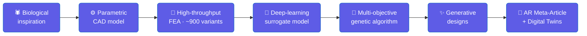

<!-- ============================== HEADER ============================== -->
<a href="https://iamashkan.github.io/portfolio/">
  
</a>

<div align="center">

<a href="https://git.io/typing-svg">
  
</a>

<br/>

<a href="https://www.researchgate.net/profile/Ashkan-Aghamoali"></a>
<a href="https://www.linkedin.com/in/ashkan-aghamoali/"></a>
<a href="https://iamashkan.github.io/portfolio/"></a>
<a href="mailto:ashkaan.aghamoali@gmail.com"></a>


</div>

---

### `$ ashkan --whoami`

```python
class AshkanAghamoali:
    """AI Researcher · XR Developer · Published Author"""

    def __init__(self):
        self.affiliation = "Mechanical Intelligence (MI) Research Group — LSBU"
        self.based_in    = "Dubai, UAE"
        self.education    = "M.Sc. Digital Electronic Systems"
        self.research     = ["biomimetics", "digital twins",
                             "generative design", "computer vision"]
        self.stack        = ["Python", "Swift", "C#", "PyTorch", "Unity", "ROS 2"]
        self.philosophy   = "simulation-first, hardware-ready"

    def current_focus(self) -> list[str]:
        return [
            "Turning industrial scrap into recovered value  (Re-X digital twins)",
            "Making the physical world queryable  (ARKit + on-device ML)",
            "Bio-inspired structures optimized by  FEA → deep learning → GA",
        ]

    def collaborators(self):
        return ["MI Research Group (LSBU)", "Prof. Stanislav Gorb (Kiel Uni)"]
```

---

### 📚 Peer-Reviewed Research &nbsp;·&nbsp; *equal-contributing author on both*

**1 · The Rise of Metaverse Manufacturing** — *towards a universal, sustainable & bioinspired industrial ecosystem*

<a href="https://doi.org/10.1098/rsif.2025.0480"></a>
<a href="https://doi.org/10.1098/rsif.2025.0480"></a>

> Eraghi, Toofani, **Aghamoali**, Zoroufi, Shafaghi, Jafari, Goel, Rajabi · *Journal of the Royal Society Interface* **23**, 20250480
> A framework uniting **complex adaptive systems**, **digital twins**, **XR**, **AI** and **biomimetics** into a sustainable Industry 5.0 manufacturing ecosystem aligned with the UN SDGs.

**2 · One to Many: An Intelligent Biomimetic Design Framework for Functional Diversification**


> Toofani, Eraghi, **Aghamoali**, Zoroufi, Khaheshi, Basti, **Gorb**, Rajabi · MI Research Group (LSBU) × Kiel University
> Spider-*sigillae*-inspired **"plate-pillar"** structures → high-throughput **FEA of ~900 variants** → **deep-neural-network** surrogate models → **multi-objective genetic-algorithm** generative design → a compliant hinge, mechanical joint, tunable springs & an adaptive soft gripper — delivered as an interactive **AR "Meta-Article."**

---

### 🧬 How my research becomes code



---

### 🚀 Flagship Engineering

<details open>
<summary><b>♻️ &nbsp;Circular-Economy Digital Twins</b></summary>
<br/>

| Project | What it does | Stack |
|---|---|---|
| [**UR5e Circular Motor Recovery**](https://github.com/iamashkan/UR5e-Circular-Motor-Recovery) | A UR5e cobot disassembles failed motors and sorts every part into Reuse / Repair / Replace / Recycle | `ROS 2 Jazzy` `MoveIt 2` `Gazebo` `Unity` |
| [**Battery Sorting Digital Twin**](https://github.com/iamashkan/Battery-Sorting-in-Digital-Twin) | Operational control twin for a battery-recovery micro-factory, with digital product passports | `Unity` `FastAPI` `CV` `Streamlit` |
| [**Defect Inspection Twin**](https://github.com/iamashkan/defect-inspection-digital-twin) | PyTorch surface-defect CV + Grad-CAM heatmaps → structured recovery decision | `PyTorch` `OpenCV` `ROS 2` |
| [**Re-X Inspection Twin**](https://github.com/iamashkan/re-x-inspection-digital-twin) | Inspection pipeline aligned to the RESCu-M2 research theme | `PyTorch` `Grad-CAM` `ROS 2` |

</details>

<details open>
<summary><b>📡 &nbsp;Spatial Computing & Industrial AR</b></summary>
<br/>

| Project | What it does | Stack |
|---|---|---|
| [**Real-Time Digital Twin on iOS**](https://github.com/iamashkan/Real-Time-Digital-Twin-Generation-on-IOS) | Scans industrial rooms into live, queryable 3D twins bound to real devices | `Swift` `ARKit` `RoomPlan` `Core ML` `MQTT` |
| [**Semantic Segmentation AR**](https://github.com/iamashkan/Semantic-Segmentation-using-Unity-and-Niantic-Lightship) | Environment-aware AR powered by real-time semantic segmentation | `Unity` `Niantic Lightship` |
| [**WebAR Face Filter**](https://github.com/iamashkan/WebAR-FaceFilter) | Browser-native AR face tracking — no app install | `Unity` `Needle Engine` |

</details>

<details open>
<summary><b>⚡ &nbsp;Smart Systems & Edge AI</b></summary>
<br/>

| Project | What it does | Stack |
|---|---|---|
| [**Smart Highway Lighting**](https://github.com/iamashkan/Smart-Highway-Lighting) ⭐ | Emergency-aware adaptive motorway lighting — **up to 70% energy saved** | `Python` `STM32` `MQTT` `Unity 6` |
| [**Solar Sentinel**](https://github.com/iamashkan/solar-sentinel) | Solar-farm twin: CV panel inspection + water-budgeted cleaning-robot dispatch | `Python` `ROS 2` `Streamlit` |
| [**Market Price Bot**](https://github.com/iamashkan/CurrencyRateTelegramBot) | Serverless Telegram bot posting live FX / gold / crypto prices | `Cloudflare Workers` `JavaScript` |

</details>

---

### 🛠️ Tech Arsenal

**Languages** &nbsp;


**Research & ML** &nbsp;


**XR · 3D · Robotics** &nbsp;


**Backend · Edge · Infra** &nbsp;


---

<!-- ============================== SNAKE ============================== -->
<div align="center">

<picture>
  <source media="(prefers-color-scheme: dark)" srcset="https://raw.githubusercontent.com/iamashkan/iamashkan/output/github-snake-dark.svg" />
  <source media="(prefers-color-scheme: light)" srcset="https://raw.githubusercontent.com/iamashkan/iamashkan/output/github-snake.svg" />
  
</picture>

### 📊 GitHub Activity


</div>

---

<div align="center">

*“The best way to recover value from the physical world is to first give it a digital mind.”*


</div>
